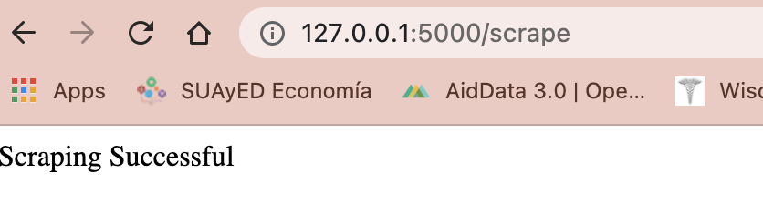
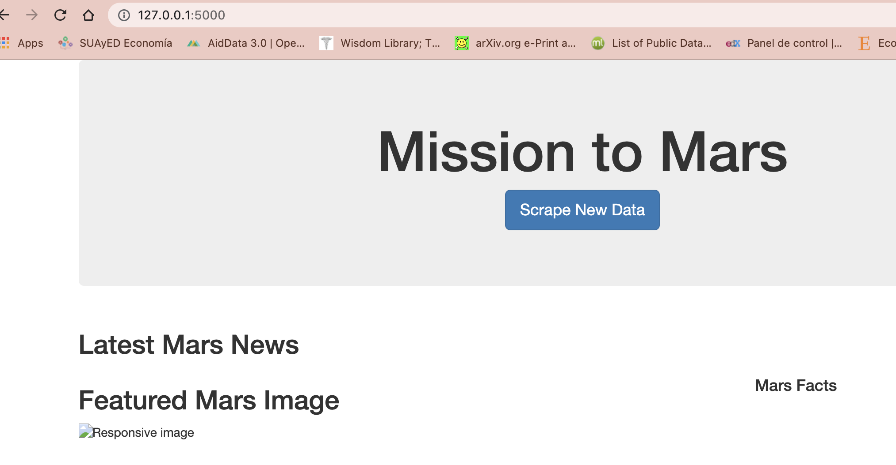
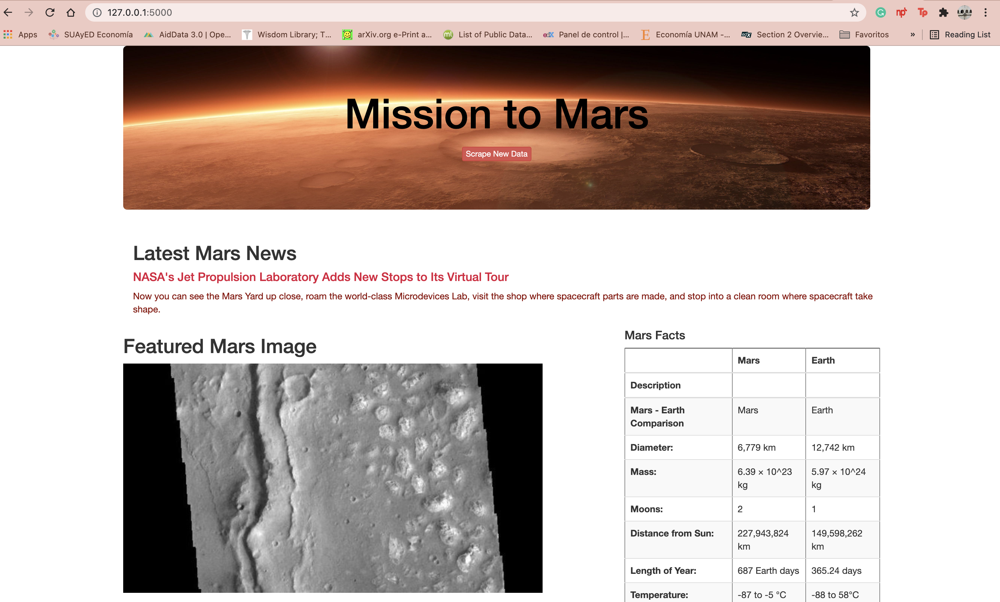
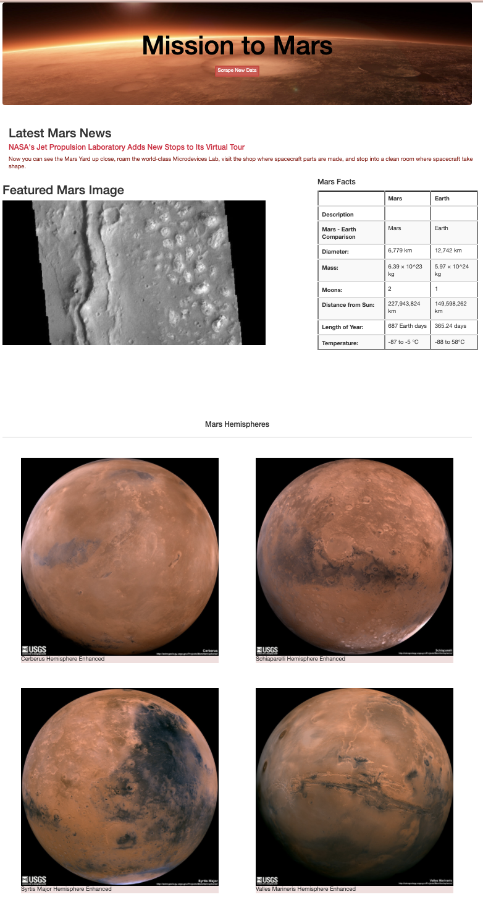

# **Mission-to-Mars Project :military_helmet:

This assignment has the intention to automate a web browser by extracting data from different websites that store data about the Mission to Mars. Using a NonSQL database, the data is render in a web application created with Flask.

This project includes the following applications as well as outcome tools:
- Use _HTML elements_, as well as class and id attributes, to identify content for `web scraping`.
- Use _BeautifulSoup_ and _Splinter_ to automate a web browser and perform a web scrape.
- Create a MongoDB database to store data from the web scrape.
- Create a web application with Flask to display the data from the web scrape.
- Create an _HTML/CSS_ portfolio to showcase projects.

***Scraping Data Flow :mag_right:

## **Overview of Project
The html portfolio shows the scraped data in regard to Facts, News, Featured Mars Image as well as the Hemispheres.

The project has four deliveries:
>1. Deliverable 1: Scrape Full-Resolution Mars Hemisphere Images and Titles
>2. Deliverable 2: Update the Web App with Mars Hemisphere Images and Titles
>3. Deliverable 3: Add Bootstrap 3 Components
>4. Extra: A written report on the employee database analysis `README.md`.

### **Resources generated:

-_Data Source: Mission_to_Mars.ipynb, app.py, scraping.py and index.html
-_Data Tools: Jupyter Notebook, Python and MongoDB
-_Software: MongoDB, Python 3.8.3, Visual Studio Code 1.50.0, Flask Version 1.0.2
(Here is the documentation for Mongo https://docs.mongodb.com/)

## **Results

The HTML scraped website run through the link http://127.0.0.1:5000/

- BEFORE CHALLENGE WEBSITE

- AFTER INCLUDING DELIVERABLES IN WEBSITE Mission to Mars -> Headline :vulcan_salute:

## **Summary

Here is the final outcome of the website that updates the Mongo database and modifies the `index.html`. This is due to retrieve hemisphere images as well as facts about about Planet Mars in comparisson with Planet Earth.

Full View of WEBSITE MISSION TO MARS :)

